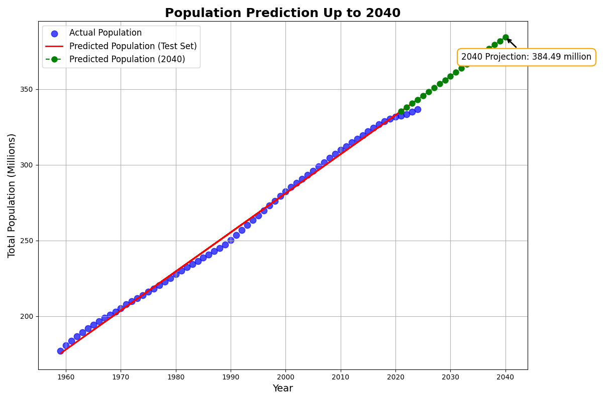

# Data Visualizaion US Population Projection

## US Population Prediction (2020–2040)

This analysis predicts the US population growth from 2020 to 2040 based on historical trends in fertility rates, migration rates, and population data. It includes three growth scenarios—low, medium, and high-each taking into account varying fertility and migration rates.

Data Sources

 1. Fertility Rates: Historical data for births per woman in the United States.
 2. Migration Rates: Net migration rate per 1,000 people per year.
 3. Population Data: Historical total population of the United States.

## Crude Projection

* The following is a basic projection of the U.S. population based solely on historical trends and facts. It does not account for factors such as migration or, more importantly, the country’s fertility rate and its trends. While the scatter plot shows a decline in population growth, the Linear Regression model used here fails to fully capture that. The predicted population for the year 2040 is 384.48 million.

## Fertility Rate Prediction

* A key factor in demographic projections is a country’s fertility rate. In the case of the U.S., the fertility rate has fallen below **2.1** the level needed for a population to sustain itself without relying on migration. This decline raises important considerations for future growth.

* US does not reproduce itself since 2008, I wonder why?... (Inflection Point)

## Prediction Without Migration

* The following prediction focuses solely on fertility rates, their trends, and future projections of population, excluding migration. We see a stark contrast between the current U.S. population of 336 million in 2024 and this model’s projection of only about 270 million at 2024. The “missing people” in this scenario are immigrants—individuals born outside the country who are not accounted for in this model. This highlights the trajectory of the U.S. population if there were no or minimal migration given our fertility rate that is below **2.1**

## The most likely scenario of the US population

* Below is the primary projection of the U.S. population up to the year 2040, accounting for historical fertility and migration trends. This model incorporates low, medium, and high growth scenarios, following the UN standard. The medium scenario, considered the most probable, estimates that the U.S. population will reach approximately **347 million by 2040** a relatively slow growth compared to past trends.

### Coeficient dependencies

* Coefficient of dependency on fertility rate: **-0.0146**
* Coefficient of dependency on migration rate: **0.0235**

### **Migration rate has a larger impact on population growth than fertility rate.**

1. Migration is a stronger factor influencing U.S. population growth than fertility, as shown by the larger positive coefficient for migration (0.0235) compared to the negative fertility coefficient (-0.0146).
2. This reflects the reality that immigration has played a crucial role in maintaining and increasing the U.S. population, while fertility rates have been declining and are currently below the replacement level.
3. The U.S. population would likely grow more slowly or even decline if it relied solely on fertility without migration.

## Sources for the project

* The primary source for this Data Visualization project was official U.S. Census data, sourced from Census.gov. This provided the historical and current population trends.
* Immigration data was obtained from the historical records of the Department of Homeland Security (DHS), which offered valuable insights into migration trends shaping the U.S. population.
